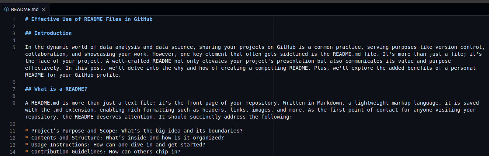
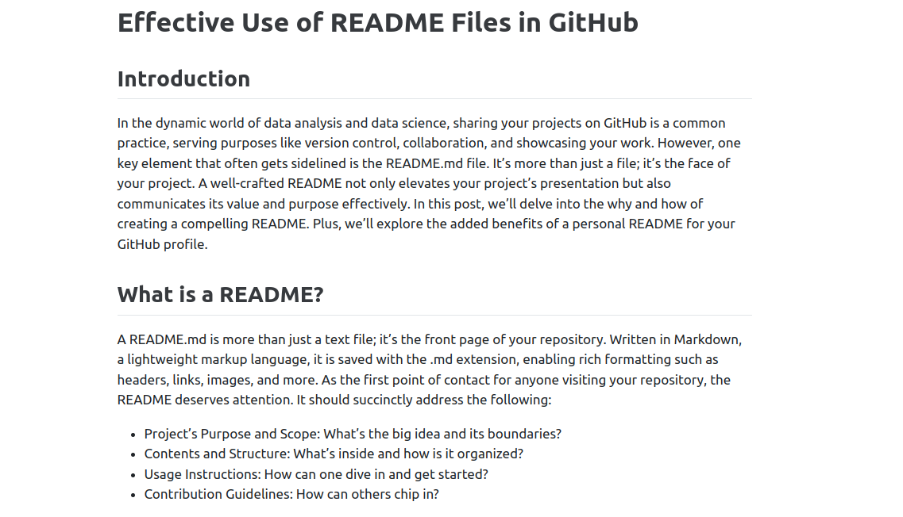
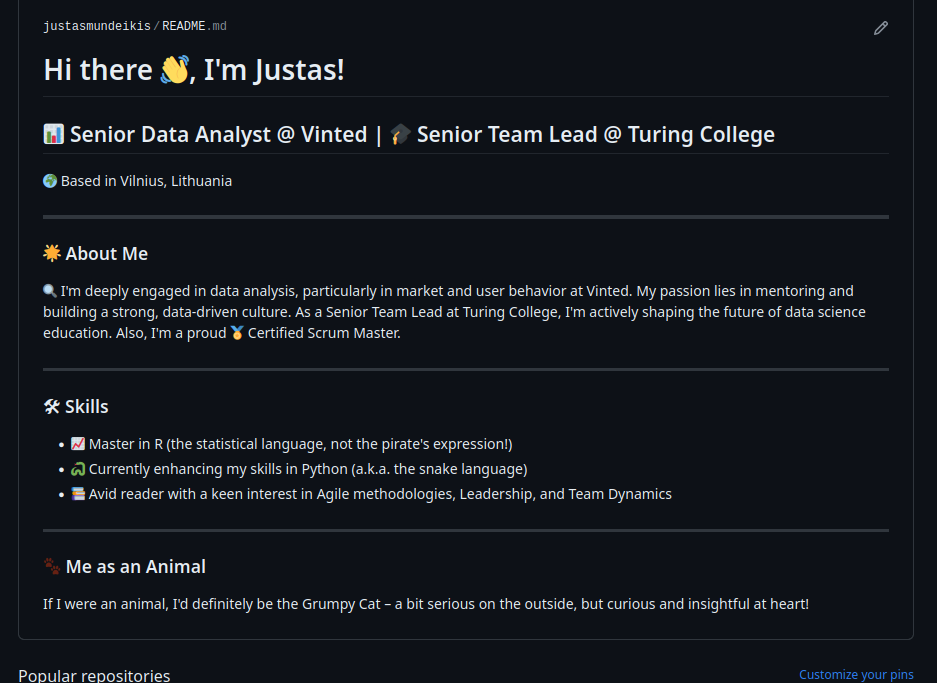
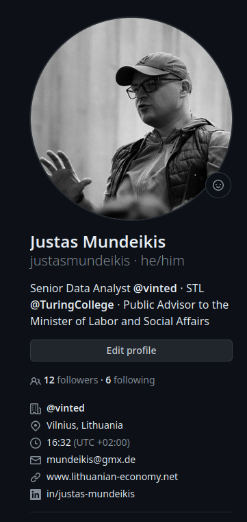

# Effective Use of README Files in GitHub

## Introduction

In the dynamic world of data analysis and data science, sharing your projects on GitHub is a common practice, serving purposes like version control, collaboration, and showcasing your work. However, one key element that often gets sidelined is the README.md file. It's more than just a file; it's the face of your project. A well-crafted README not only elevates your project's presentation but also communicates its value and purpose effectively. In this post, we'll delve into the why and how of creating a compelling README. Plus, we'll explore the added benefits of a personal README for your GitHub profile.

## What is a README?

A README.md is more than just a text file; it's the front page of your repository. Written in Markdown, a lightweight markup language, it is saved with the .md extension, enabling rich formatting such as headers, links, images, and more. As the first point of contact for anyone visiting your repository, the README deserves attention. It should succinctly address the following:

* Project’s Purpose and Scope: What's the big idea and its boundaries?
* Contents and Structure: What’s inside and how is it organized?
* Usage Instructions: How can one dive in and get started?
* Contribution Guidelines: How can others chip in?

Here’s a glimpse of what a Markdown README looks like:

And here's how it transforms on GitHub, turning into a polished, HTML-styled page:

You can learn more about Markdown at the [CommonMark](https://commonmark.org/), which also has a helpful [reference guide](https://commonmark.org/help/) and an [interactive tutorial](https://commonmark.org/help/tutorial/). There are some derivations of Markdown, such as RMarkdown. You can read about them [here](https://bookdown.org/yihui/blogdown/output-format.html). 

## When and How to Write a README

### Getting Started with Your README

Initiate a README with your repository's creation. Early stages might not offer complete details, but starting this document early sets a foundation for quality.  As your project grows, keep your README updated - it's crucial for reflecting your project's current state and keeping everyone in the loop.

### Editing Your README: The Best Approach

While you can edit the README directly on GitHub, a better option is to work on it locally using tools like Visual Studio Code (VS Code) or Sublime Text. These editors make the job easier and more efficient, thanks to their markdown-friendly features like syntax highlighting and live previews. It’s a small step that makes a big difference in managing your project’s documentation.

## Crafting an Effective README

Creating an effective README is both an art and a science. It’s about making your project inviting and understandable to your audience. Here are some key elements to consider:

### Title

Your title is the headline of your project. It should be clear, descriptive, and capture the essence of your work. Using a single # for the title in Markdown sets it apart with prominence, making it the first thing people notice.

### Badges
Badges offer a fast and efficient way to convey key information about your project. Services like Shields.io provide badges that can display build status, test coverage, license information, and more. They're like the quick stats of your project, offering insights at a glance.

### Table of Contents

For more substantial projects, a table of contents is a godsend. It helps users navigate your README, especially when it’s packed with information. It's like a map, guiding readers to the section they need without any hassle.

### Description

This is where you tell the story of your project. A well-crafted description addresses the WHAT, WHY, and HOW:

* What is this project about? Briefly describe the essence of your project.
* What problem are you solving? Highlight the challenge your project addresses.
* What is the solution? Discuss how your project tackles the problem.
* Why this project? Share your motivation behind choosing this project.
* Functionality: What does your application do?
* Challenges and Solutions: Talk about the hurdles you faced and how you overcame them.

### Contents

If your project is a complex maze of files and folders, guide your users through it. Describing the structure or providing a visual representation can significantly help in understanding how your project is organized.

### Usage

This section is crucial. It should clearly explain how someone can set up and use your project. Cover things like:
* Setup Instructions: Step-by-step guide for setting up your project.
* Required Software and Libraries: List the tools and libraries needed.
* Data Flow: Describe how data moves through your project, possibly with diagrams or flowcharts.

### Roadmap

If your project is ongoing, a roadmap can be exciting. It gives readers a glimpse into the future of your project, outlining upcoming features or areas for development. It’s also a great way to invite collaboration on specific aspects.

### Useful Links and Credits

Here, you can link to additional resources, tutorials, or acknowledgments. If your project is a collaborative effort, give credit where it’s due. And if it's a significant project, consider adding a license. Helpful guidance on choosing the right one can be found at choosealicense.com.

### Contribution

If you’re open to contributions, let people know how they can help. Linking to GitHub’s contribution guidelines can provide potential contributors with the information they need to get started.

### License

Finally, the license. It’s vital, especially for open-source projects. It tells users what they can and cannot do with your code. For advice on which license to choose, check out this resource.

## Personal README on GitHub

A personal README in a repository named after your username acts as a professional portfolio on GitHub. This is particularly beneficial for newcomers to the data field. Highlight significant projects, contributions, and areas open for collaboration. This README serves as a valuable tool for networking and job searching.

### Introducing Yourself

* Who You Are: Start with a warm introduction. Share a bit about your background, your journey into data science, and what excites you about this field.
* Your Professional Goals: Talk about your career goals or what you aspire to achieve in the realm of data science. This gives visitors an insight into your professional direction and ambitions.

### Showcasing Projects and Skills

* Select Projects: Carefully pick projects that best represent your skills and journey. For each, include a summary, the tech stack used, and any unique challenges you faced and overcame.
* Skillset: Enumerate the tools, languages, and technologies you’re proficient in. Be specific – if you’re great at Python, say so; if you’ve mastered R for data visualization, highlight that.

### Encouraging Collaboration

* Open for Collaboration: If you’re seeking opportunities to collaborate, make it clear. Describe the types of projects or areas you’re interested in and how others can join you or contribute.
* Highlighting Contributions: If you’ve contributed to open-source or other collaborative projects, showcase them. This not only shows your technical skills but also your ability to work in a community.

### Networking and Career Advancement

* Networking Opportunities: Your README can serve as a networking nexus, connecting you with like-minded professionals, potential mentors, or collaborators. It's a platform to engage with the broader data science community.
* A Tool for Job Seekers: For those in the job market, this README acts as a living resume. It’s a dynamic reflection of your evolving professional profile, offering recruiters a deeper, more comprehensive understanding of your capabilities and experiences.
* Personal Brand Development: This document is a chance to craft and showcase your personal brand. The projects you choose, the way you describe your journey, and the information you share all contribute to how you’re perceived in the tech community.

### The Art of Regular Updates

Keeping It Fresh: Regular updates are crucial. As you evolve professionally, so should your README. Add new projects, update your skills, and refine your career aspirations. This constant updating signals your active engagement in your field and ensures that visitors always have the latest view of your professional life.

### GitHub Profile README Generator

If you're looking for a quick way to get started, check out this [GitHub Profile README Generator](https://rahuldkjain.github.io/gh-profile-readme-generator/)

### Personal info

While you're updating your README, take a moment to enrich your GitHub profile with some personal touches. It’s about making your digital presence more human and approachable. Here’s how you can do it:

* Professional Profile Picture: A picture is worth a thousand words, and this holds true for your GitHub profile as well. Add a profile picture that aligns with your professional image. A good choice is to use the same picture you have on LinkedIn. This consistency in imagery across platforms helps in building a recognizable personal brand.
* Professional Summary: Use the bio section effectively to introduce yourself with a succinct professional summary. This could include your current role, areas of expertise, and what you're passionate about in your field. You can use the same you used on LinkedIn.
* Linking Up: Connect your GitHub presence to your broader professional network. Include links to your LinkedIn for detailed work history, Twitter for industry commentary and engagement, and any other platforms where you contribute professionally.
    

### Why it matters?

* Making Strong First Impressions: The combination of a professional photo and well-placed links creates a powerful first impression. It showcases a polished and deliberate approach to your professional persona.
* Establishing Trust and Credibility: An updated profile with a coherent story adds layers of trust and credibility. It signals to viewers that you are engaged in your profession and attentive to details.
* Cohesive Professional Narrative: Linking your GitHub profile with other professional platforms weaves a cohesive narrative about your career and interests. It allows others to see the breadth of your professional life, understand your contributions to the field, and recognize your areas of expertise.